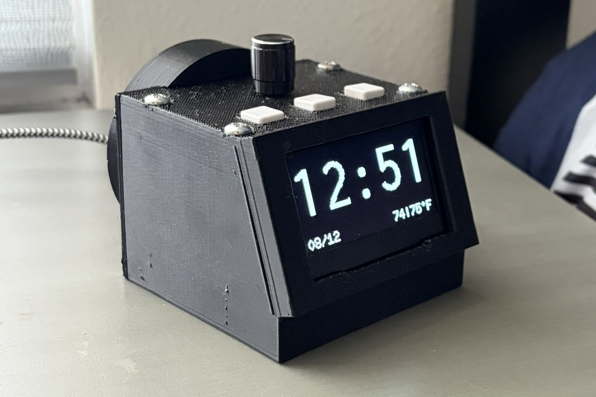
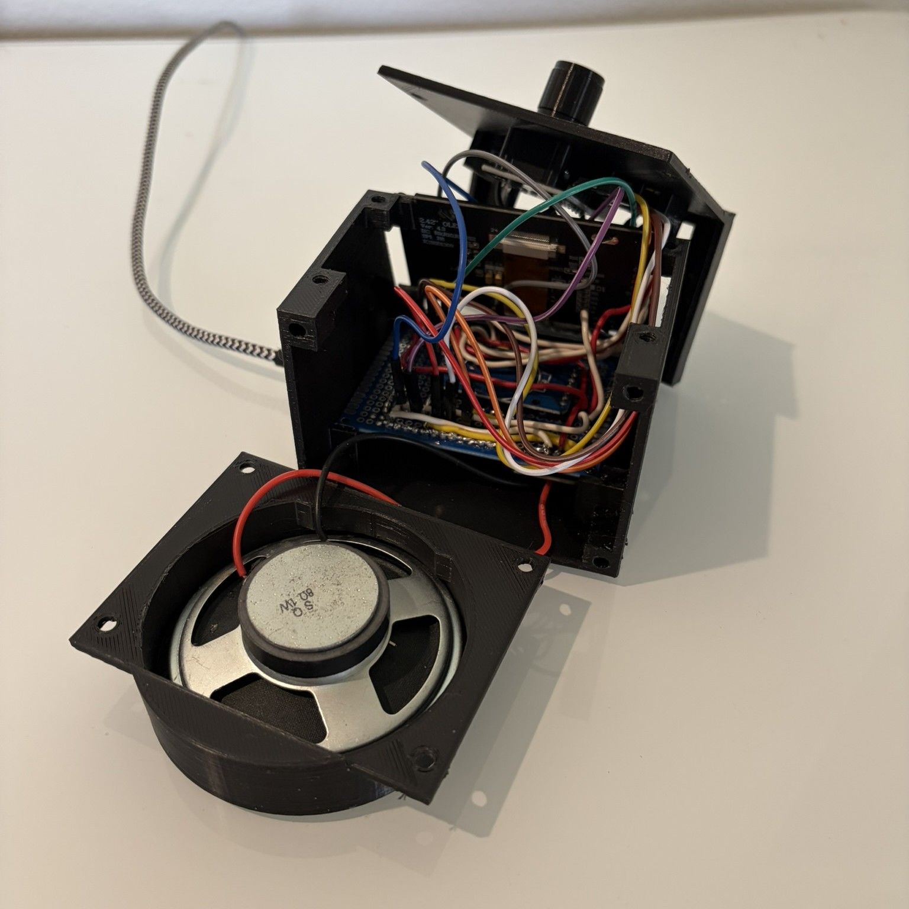

# The World's Worst Alarm Clock Ever

An ESP32 alarm clock that keeps perfect time, pulls the weather, works as a Bluetooth speaker, and most importantly, it is very unpredictable.

It is a genuinely good alarm clock. It syncs from NTP, it has a battery-backed RTC so a power cut doesn't touch it, it dims itself at night, and also has forty different ways of ruining your morning.



**Demo video:** _(coming soon)_

---

## Why

My roommate needed a new alarm clock, so I took it upon myself to make his life as slightly inconvenient as I could. The problem with a normal alarm is that it works exactly how it is supposed to. Where is the fun in that? This alarm clock is packed with a variety of "features" that do anything from canceling your alarm for no reason to whispering at you in your sleep. 

---

## What it does

**Clock** — Battery-backed DS3231 corrected from NTP at boot. 12/24 hour, date, live temperature. 45 selectable clock fonts, cycled straight from the knob. Automatic night mode dims the panel at a set hour and strips the screen back to just the time. Four brightness levels driven by the SSD1309's real contrast, pre-charge and VCOMH registers, so it goes genuinely dark rather than just dim.

**Weather** — Current temperature and today's high from open-meteo, switching to tomorrow's high in the evening. Multiple saved locations with full POSIX timezone and DST rules; changing location re-syncs both the clock and the forecast. WiFi powers down between refreshes, and a reading that has failed to update several times running is marked stale rather than silently shown as current.

**Alarm** — Set from the menu or armed with one button on the clock face. Plays any WAV or MP3 from the on-board filesystem, and several can be chained into a sequence. The panel flashes while it rings, and a ring pulls the display out of night mode — then puts it back afterwards.

**Bluetooth speaker** — The clock is an A2DP sink. Track title and artist scroll along the bottom and freeze when you pause; the three front buttons become transport controls and the knob is volume. An alarm going off will drop the Bluetooth link, take the audio hardware back, and ring.


---

## The trolls

Forty randomly-triggered events that range from quick visual gags to multi-hour long interruptions.


**Minor** gags are dismissed by any button — a school of fish swims across the clock, a figure paces the screen with footstep audio, the digits scroll too fast to read, the whole clock comes loose and drifts.

**Major** ones freeze the buttons. A firmware update that takes an hour and never finishes. A system error counting down in milliseconds to a reset that never comes. A self-destruct that strobes, detonates, and then leaves you looking at ten full seconds of dead screen wondering whether you've killed it — before the clock crawls back in from off-screen, one element at a time.

**Daily** moods are rolled each morning and last all day: a fish tank in front of the still-working clock, the entire display rotated 180°, or the clock shrunk to a tiny readout with the font control disabled.

**Weather scenes** track the real forecast — drizzle, rain, showers, snow and thunderstorms, each with its own particle density, fall speed, wind slant and animation cadence. When it's raining outside, it rains on your clock.


**Fundamentals** aren't events at all, they're permanent changes in behaviour. The snooze wheel replaces your snooze length with a slot machine. Snooze games make you win a minigame to earn one — lose, and the alarm switches off entirely and has to be re-armed by hand. Alarm drift moves the alarm up to ten minutes either way, re-rolled every time you arm it so the offset can't be learned.

There's a safety switch, accessible by a secret code, that allows the customization of the events and what they are capable of. That's the difference between something you can sleep next to and a science experiment.

---

## Engineering notes

Forty gags share one codebase without turning into forty special cases, mostly because trolls are treated as data rather than code. Each one is a row in a table — kind, duration, whether it draws over the clock, function pointers for its lifecycle hooks. Adding a new troll means an enum entry, a table row, and a draw function; the menu entry, saved on/off state, random scheduling, and input handling come for free. A static_assert catches it if the enum and table ever drift out of sync.

Trolls don't touch the clock state directly. They write to a set of hooks — fake times, per-element pixel offsets, layout flags — that get reset centrally whenever an event ends. That's what stops a cancelled or interrupted troll from leaving the clock in a broken state.

Animation is stateless. Every draw call works out where it is in the sequence as a fraction from 0 to 1 and renders from that alone — nothing increments a frame counter. That means frame rate doesn't matter, there's no state to clean up, and frame 900 renders correctly without stepping through the 899 before it.

Bluetooth and the sound engine fight over the same I2S peripheral, since only one driver can hold it at a time. Switching to speaker mode tears down the sound engine's driver and hands the pins to the A2DP sink; switching back reinstalls it, and an alarm that fires mid-Bluetooth-playback does that handoff live. Getting the Bluetooth stack to fit at all meant giving up the second OTA slot for a custom partition table.

It's a clock, so it has to behave like one even when things go wrong. It comes up on the RTC's last known time if there's no network at boot. Buttons are interrupt-driven with debounce handled in the ISR itself. State transitions are owned by a single file instead of being triggered piecemeal from whatever module wants one. If nobody touches it for a few days, it dims the display and suspends every troll until someone interacts with it again.

Every tunable value — pins, timeouts, night-mode hours, sound files and volumes, per-troll trigger odds, fish swim speed, blink frequency — lives in one config file, so behavior can be adjusted without touching the logic anywhere else.

Designing and printing the case was one of the most time consuming parts of the whole project. The measurements are extremely precise and it took multiple renditions to perfectly narrow down the design. The STL file is shown below.

Stack: C++ on ESP32 / Arduino via PlatformIO · U8g2 · ESP8266Audio · ESP32-A2DP · ArduinoJson · LittleFS · NVS · open-meteo

---

## Hardware

ESP32, SSD1309 128×64 SPI OLED, DS3231 RTC, rotary encoder, three buttons, and a MAX98357A I2S amplifier driving a small speaker.

## Parts list
- [ESP32 dev board](https://www.amazon.com/ESP-WROOM-32-Development-Dual-Mode-Microcontroller-Integrated/dp/B0BK13HWBJ?crid=BL2BS80EYGM7&dib=eyJ2IjoiMSJ9.mYrviO_4Gnr39KcbK8VjFAi-1GUcFsmeBokAXGn0k0Dk2YvQ-payRvU0_jddVJtn3o42sVWTIRKopTGt08j-5MaQkEx9UFx7hs2UqvqxcJvGvUsA34bJjbc-fVyyeIaK3d-UitD-700XW_3NH1Mfsdeii5Joy_vmQqu7BimeQ5z6zLYIxhZ1yXgWDSaNIf9T0JDUM7itV0Q8g_YqQv0SiV4BzgZGlYDyYb2X_dUEDBg.aSdi4Sbn0OubSRkG_Zvv1XDPCcFbNZUG9AZI_xPLnHc&dib_tag=se&keywords=ESP32%2BWROOM%2B32%2Bmelife&qid=1778305449&sprefix=esp32%2Bwroom%2B32%2Bmelif%2Caps%2C311&sr=8-6&th=1)
- [SSD1309 2.42" OLED (SPI version)](https://www.aliexpress.us/item/2255799816264653.html?spm=a2g0o.order_list.order_list_main.10.3dcd1802b7C0o8&gatewayAdapt=glo2usa)
- [KY-040 rotary encoder](https://www.aliexpress.us/item/3256807353813379.html?spm=a2g0o.order_list.order_list_main.15.3dcd1802b7C0o8&gatewayAdapt=glo2usa&_randl_shipto=US)
- [8Ω speaker](https://www.aliexpress.us/item/3256807619443281.html?spm=a2g0o.productlist.main.3.1b405975ZzXg5d&algo_pvid=5acbd5a5-8fb6-43b6-a3f9-a8abcb8a8837&algo_exp_id=5acbd5a5-8fb6-43b6-a3f9-a8abcb8a8837-2&pdp_ext_f=%7B%22order%22%3A%222407%22%2C%22eval%22%3A%221%22%2C%22orig_sl_item_id%22%3A%221005007805758033%22%2C%22orig_item_id%22%3A%221005006344913948%22%2C%22fromPage%22%3A%22search%22%7D&pdp_npi=6%40dis%21USD%215.13%210.99%21%21%2134.46%216.67%21%4021032c8d17865856176421300e0cf4%2112000042262327050%21sea%21US%212688206086%21X%211%210%21n_tag%3A-29919%3Bd%3Acc9dd226%3Bm03_new_user%3A-29895%3BpisId%3A5000000214298657&curPageLogUid=YCjim9C9pwCF&utparam-url=scene%3Asearch%7Cquery_from%3A%7Cx_object_id%3A1005007805758033%7C_p_origin_prod%3A1005006344913948)
- [DS3231 RTC module](https://www.aliexpress.us/item/3256805941102171.html?pdp_npi=4%40dis%21USD%21US+%248.26%21US+%240.99%21%21%2155.42%216.61%21%402103284e17865876577365998db35f%2112000035879185769%21sh%21US%212688206086%21X&spm=a2g0o.store_pc_home.allitems_choice_2005584863599.1005006127416923&gatewayAdapt=glo2usa)
- [MAX 98357 amplifier](https://www.amazon.com/dp/B0DPJRLMDJ?ref=ppx_yo2ov_dt_b_fed_asin_title)
- [Buttons](https://www.amazon.com/20pcs-Momentary-Tactile-Button-Switch/dp/B008DGA9UY?dib=eyJ2IjoiMSJ9.swj8hMR-DzLd3viAnhKk-iLZqAFIq1X_j61PHujkNcV8BBvYxoIHh7Gbz_hOxlMkDzS0p5VUAKUA-vZ49HhCpyjpbUONDjQZTRXIggy0SOFJFqWgcu2Ktd5rNToGrMSoYEfQnMGHS-f3hNMqWfN3lOMD3ZuzMz5xPaJ9ErSxg0d6xGNy1S8AIhagiw3UR4eLSERgrMBHy0fKgMbF7br46peLps43bUfjueGkYiHN7tg.Vn7eBTjpdz-CCw3heCwbEqKy38GOFEqBfDTcdV3j9bw&dib_tag=se&keywords=12mm+tactile+push+button+momentary+switch%22&qid=1778309688&sr=8-3)
## Printable enclosure (STL)
[](https://www.thingiverse.com/thing:7395218)

-Alternate download:
[STL file](docs/WorstAlarmClockEver.stl)




---

## Code layout

```
include/values.h          every tunable number, in one place
src/application_code.cpp  main loop and every state transition
src/clock_logic.cpp       timekeeping, WiFi, weather
src/clock.cpp             clock face, brightness, night mode, fonts
src/alarm.cpp             setting, checking and ringing the alarm
src/audio.cpp             WAV/MP3 playback with a play queue
src/menu.cpp              settings, and the hidden troll menu
src/bluetooth.cpp         A2DP speaker mode
src/troll_events.cpp      all forty trolls
src/display.cpp           the panel, plus a time-based animation toolkit
```

Built with [PlatformIO](https://platformio.org/). Copy `include/secretsFILLER.h` to `include/secrets.h` and add your WiFi details before building.

---

Fonts from [U8g2](https://github.com/olikraus/u8g2). Weather from [open-meteo](https://open-meteo.com/). Bluetooth via [ESP32-A2DP](https://github.com/pschatzmann/ESP32-A2DP). Animations built with the [Wokwi animator](https://wokwi.com/animator), icons by [icons8](https://icons8.com/).
